<!-- AOC TILES BEGIN -->
<h1 align="center">
  2025 - 24 ⭐ - TypeScript
</h1>
<a href="day_01/index.ts">
  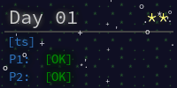
</a>
<a href="day_02/index.ts">
  
</a>
<a href="day_03/index.ts">
  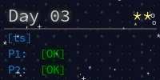
</a>
<a href="day_04/index.ts">
  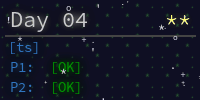
</a>
<a href="day_05/index.ts">
  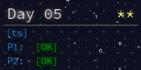
</a>
<a href="day_06/index.ts">
  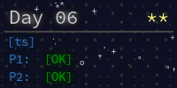
</a>
<a href="day_07/index.ts">
  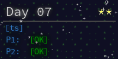
</a>
<a href="day_08/index.ts">
  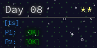
</a>
<a href="day_09/index.ts">
  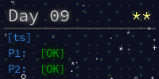
</a>
<a href="day_10/index.ts">
  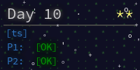
</a>
<a href="day_11/index.ts">
  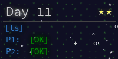
</a>
<a href="day_12/index.ts">
  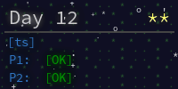
</a>
<!-- AOC TILES END -->

To install dependencies:

```bash
bun install
```

To configure environment variables:
```bash
cp .env.example .env
```

To run:

```bash
# Run a specific day (e.g., day 3)
bun run day 3

# Run all days
bun run all

# Create a new day folder (e.g., day_05)
bun run create 5
```

This project was created using `bun init` in bun v1.3.3. [Bun](https://bun.com) is a fast all-in-one JavaScript runtime.
